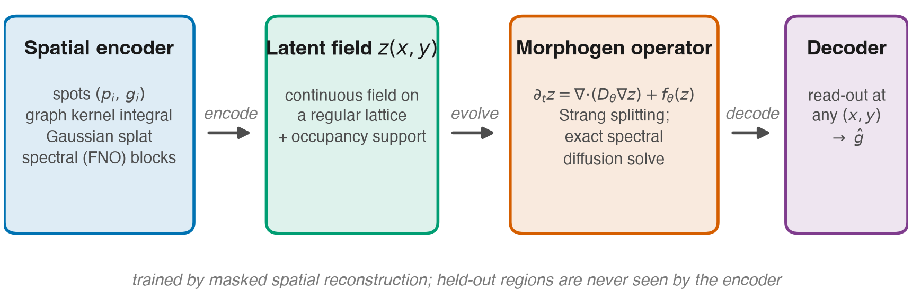

# Neural Morphogen Operators

**Learning Continuous Reaction–Diffusion Dynamics from Spatial Transcriptomics**

Most machine learning for spatial transcriptomics treats a tissue section as a
*graph* over the measured spots. Developmental biology describes the same tissue
as the product of *continuous* spatial processes — morphogen gradients, diffusive
signalling, local reaction networks. This repository asks whether an operator of
that second kind can be fitted directly to spatial expression data, and what it
buys.

**Neural Reaction--Diffusion Operators (NRDO)** encode irregularly sampled expression into a
continuous latent field, evolve that field under a learned anisotropic
reaction–diffusion PDE

$$\frac{\partial z}{\partial t} = \nabla \cdot \left( D_\theta(z)\, \nabla z \right) + f_\theta(z)$$

and decode expression at **arbitrary** coordinates — including where nothing was
measured.

<p align="center">
  
</p>

---

## What this project does and does not claim

This matters more than the benchmark numbers, so it comes first.

**Claimed.** Treating tissue as a continuous field rather than a discrete graph
improves prediction at unmeasured coordinates. Across 22 sections and four
technologies, and at the conservative unit of analysis — 10 **independent
specimens**, since twelve of the sections are serial sections of one brain — the
advantage survives Holm correction against three baselines including a graph
model. An exactly parameter-matched control attributes the gain to the operator
rather than to capacity. The model degrades most gracefully under
**sampling-density** loss, retaining 93% of its accuracy at an eighth of the
locations against 89% for the best baseline, on both seeds — the axis a
field-based formulation predicts.

**Not claimed — and several of these were claimed in earlier revisions until a
control said otherwise.**

- *Not* that the fitted operator recovers real biochemistry (Theorem 11).
- *Not* that the recovered diffusion length is a biological measurement.
  Coordinate-**shuffled** sections, containing no spatial signal, recover 404 µm
  against 405 µm untrained; real tissue gives 375 µm. `exp11_difflen_null.py`.
- *Not* that the operator transfers. Under the held-out-block protocol it reaches
  −0.005 Pearson *r* cross-tissue against a training-mean floor of 0.000. An
  earlier random-half protocol suggested otherwise; it was scoring interpolation
  between neighbouring spots.
- *Not* that NRDO separates from **STAGATE-style** with statistical confidence:
  7 of 10 specimens, *p* = 0.43. It is distinguishable from most of this
  literature, not all of it.
- *Not* that NRDO is the most accurate model everywhere. At full sampling density
  on the section used for the robustness sweep it ranks third.

The honest framing is: **NRDO learns latent continuous operators that summarize
spatial gene-expression organization within a section.**

Known failure mode, reported rather than hidden: predictions are systematically
**smoother** than measured tissue, and NRDO is the *worst* model tested on
Moran's *I* error. This survives training to convergence, and a spectral-matching
loss bounds rather than removes it (`experiments/exp13_spectral.py`), so the
limitation belongs to the operator class rather than to the objective.

Every claim above is checked against the run artifacts by `make check-numbers`,
which fails when prose and artifacts disagree, when a macro is quoted outside the
experiment it derives from, or when a statistic rests on fewer seeds or fewer
held-out locations than it needs. `AUDIT_OUTCOMES.md` records what this revision
withdrew, corrected and strengthened.

---

## Quick start

```bash
git clone https://github.com/sunkalpchandra/neural-morphogen-operators
cd neural-morphogen-operators

python3 -m venv .venv && source .venv/bin/activate
pip install -r requirements.txt          # or: conda env create -f environment.yml

python -m src.data.download --list       # inventory, sizes, licences
make data                                # download + preprocess everything (~4 GB)
make experiments                         # run all experiments
make paper                               # regenerate figures, tables and the PDF
```

Every step is resumable and idempotent: re-running skips completed work.

---

## Data

Six public datasets. Nothing is bundled; everything downloads with a recorded
SHA256 manifest (`data/raw/MANIFEST.json`).

| # | Dataset | Technology | Role |
|---|---------|-----------|------|
| 1 | 10x Visium Adult Mouse Brain | Visium, 55 µm spots | primary training benchmark |
| 2 | 10x Visium Human Breast Cancer | Visium, 55 µm spots | cross-tissue / cross-species transfer |
| 3 | Allen Brain Cell Atlas MERFISH | MERFISH, 500-gene panel | single-cell resolution validation |
| 4 | 10x Xenium Mouse Brain (CTX+HP) | Xenium, 248-gene panel | cross-resolution transfer |
| 5 | MOSTA Stereo-seq Mouse Embryo | Stereo-seq bin50 | developmental / morphogen setting |
| 6 | Norman et al. 2019 Perturb-seq | CRISPRa scRNA-seq | out-of-context perturbation probe |

```bash
python -m src.data.download --all                       # default set (~4 GB)
python -m src.data.download --all --with-images         # + full-resolution H&E TIFFs
python -m src.data.download --dataset merfish_allen     # one dataset
python -m src.data.build --all                          # -> data/processed/*.h5ad
```

**Raw sequencing reads are deliberately not downloaded.** The Visium `*_fastqs.tar`
bundles are hundreds of GB and re-running Space Ranger would not change any result;
we consume the vendor count matrices and record their provenance instead.

**Raw files are disposable; processed files are what experiments read.** Once a
dataset has been built into `data/processed/*.h5ad`, its raw download can be
deleted to reclaim space — `src/data/download.py` is idempotent and will re-fetch
anything missing, and `MANIFEST.json` retains the provenance record either way.
The full raw set is roughly 4 GB and the processed set roughly 350 MB.

Every processed object obeys one contract:

```
adata.X                  expression  (locations x genes, float32)
adata.obsm['spatial']    coordinates, isotropically normalised to [-1, 1]^2
adata.obsm['spatial_um'] original coordinates in microns
adata.obs['split']       train / val / test  (contiguous spatial blocks)
adata.uns['nmo']         provenance: technology, accession, licence, coord scale
```

Two preprocessing choices are load-bearing:

- **Coordinates are scaled isotropically.** Dividing *x* and *y* by different
  factors would silently distort the Laplacian and make any learned diffusion
  coefficient meaningless.
- **Splits are contiguous blocks, not random spots.** Neighbouring spots are
  highly correlated, so a random held-out spot is trivially predicted from its
  neighbours and every method scores well. Held-out *regions* are the honest test.

---

## Model

```
src/models/
  layers.py     graph kernel-integral layer, Gaussian splat, spectral conv, Fourier features
  dynamics.py   anisotropic diffusion + reaction network + Strang-split integrator
  nmo.py        encoder -> operator -> decoder
  baselines.py  6 baselines behind an identical interface
```

Three design decisions worth knowing:

**1. Diffusion is solved exactly in the Fourier domain.** For constant-coefficient
anisotropic diffusion the operator is diagonal in the Fourier basis, so evolution
over `τ` is exactly `F⁻¹ exp(−kᵀDk τ) F`. Since `kᵀDk ≥ 0`, the multiplier lies in
`(0,1]` for any timestep: the diffusive channel is **unconditionally stable**,
with no CFL constraint, no matter what the optimiser does. Rollouts stay bounded
for 10³ steps — two orders of magnitude beyond the training horizon. Positive
definiteness is structural (`D = LLᵀ + εI`), not penalised.

**2. The decoder never sees coordinates.** If it could condition on *(x, y)* it
would memorise a coordinate-to-expression map and the dynamics would become
decorative — and every ablation would be meaningless.

**3. The PDE loss is a *steady-state* residual.** Because the integrator is exact,
the residual along the model's own trajectory is zero by construction; imposing it
would penalise the integrator, not the model. The constraint with actual content is
that the measured tissue should be a **fixed point** of the learned operator,
`‖∇·(D∇z_T) + f(z_T)‖²`, which is the correct formalisation of the quasi-steady-state
assumption and constrains `D` and `f` jointly.

---

## Experiments

```bash
# Recommended: one job per ablation variant / transfer model, run through a
# worker pool. Resumable — re-running skips completed (model, seed) pairs.
WORKERS=6 EPOCHS=300 ./scripts/run_all.sh      # or: make all-experiments

# Or individually
python experiments/exp1_forecasting.py --section visium_mouse_brain --seeds 0 1 2
python experiments/exp2_cross_tissue.py --source visium_mouse_brain --target visium_human_breast
python experiments/exp3_resolution.py  --source visium_mouse_brain --targets xenium_mouse_brain
python experiments/exp4_perturbation.py
python experiments/exp5_ablations.py   --section visium_mouse_brain
python experiments/exp6_development.py                 # E9.5 -> E10.5
python experiments/exp7_numerics.py                    # integrator stability / cost
python experiments/exp8_multisection.py                # 17-section benchmark
python experiments/exp9_biology.py                     # spatial-domain preservation
python experiments/exp10_robustness.py                 # noise / dropout / density / k
python experiments/exp11_difflen_null.py               # diffusion-length null controls
python experiments/exp12_split_geometry.py             # split difficulty (no training)
python experiments/exp13_spectral.py --mode shape      # spectral-matching sweep
python experiments/exp14_converged.py                  # converged single-section
python experiments/make_figures.py                     # figures + tables + numbers

make check-numbers                                     # prose vs artifacts (CI gate)
make papers                                            # full + workshop builds
make ci                                                # tests + audit + both builds
make manifest                                          # SHA256 over every artifact
```

| Experiment | Question |
|---|---|
| 1 · Spatial forecasting | Predict expression in masked contiguous tissue blocks |
| 2 · Cross-tissue transfer | Mouse brain → human breast carcinoma, zero-shot |
| 3 · Cross-resolution | Visium spots → single-cell Xenium, zero-shot |
| 4 · Counterfactual perturbation | In-silico morphogen "bead implant" + Perturb-seq probe |
| 5 · Ablations | Which components are load-bearing? |
| 6 · Developmental forecasting | Stereo-seq E9.5 → E10.5, the one genuine temporal axis |

**Budgets are not uniform across experiments** (the benchmark uses more epochs
and seeds than the ablations, which are internally consistent at a smaller
budget). Each table caption states its own budget. Do not compare a number in
one table against a number in another without checking.

**Baselines** — non-spatial autoencoder, GCN, SpaGCN-style, STAGATE-style, graph
transformer, and an exact Gaussian process. All share the identical training loop,
masks, optimiser and evaluation code, so any difference is attributable to the
model.

Two notes on fairness. SpaGCN and STAGATE were designed for *spatial domain
identification*, not for predicting expression at unmeasured coordinates; we
implement each method's architectural core and attach the same inverse-distance
read-out head every baseline gets. They are marked **-style** and we do not claim
they reproduce the authors' published numbers on the authors' own tasks. And the
**Gaussian process is a strong baseline** — for smooth genes, classical spatial
interpolation is hard to beat, and much of this literature does not compare
against it.

**Metrics** — per-gene Pearson/Spearman across held-out locations, RMSE, SSIM on
rasterised maps, and absolute error in Moran's *I*. The last is deliberate:
correlation and RMSE both reward a model that regresses towards a smooth mean, so
a metric that penalises destroying spatial structure is required.

---

## Interpretability

Linearising the learned operator about a homogeneous state gives a **dispersion
relation** — the growth rate `max Re spec(J − |k|²D)` as a function of wavenumber.
Positive growth at finite `|k|` with decay at `k = 0` is the classical Turing
signature, and its peak identifies a characteristic wavelength in microns.

```python
report = model.stability_report(z_field, coord_scale_um=section.coord_scale_um)
report["turing_unstable"], report["k_max"], report["growth_max"]
model.diffusion_length_um(section.coord_scale_um)   # per-channel, in microns
```

This is a falsifiable statement about what the model inferred, not a visualisation.
Morphogen-pathway genes (SHH, WNT, BMP, FGF, NOTCH, RA) are **force-retained**
during gene selection so the analysis is not evaluated on a gene set that
selection already biased.

---

## Reproducibility

- Every dataset downloads automatically; `data/raw/MANIFEST.json` records URL,
  byte size and SHA256 for each artifact.
- Seeds are set for Python, NumPy and PyTorch; results are reported as
  mean ± s.d. over 3 seeds. Bitwise determinism is not achievable on all backends,
  which is why we report variability rather than claiming exact reproduction.
- Each run writes `config.yaml`, `environment.json` (versions, git commit, dirty
  flag), `metrics.jsonl` and `best.pt` to its own directory.
- **No number in the paper is hand-typed.** `paper/tables/*.tex` and
  `paper/numbers.tex` are generated from run artifacts, so the manuscript cannot
  drift from the experiments.

**Compute.** Everything here runs on a laptop CPU (developed on an Apple M2, ~2 s
per training epoch). `get_device('auto')` resolves to CUDA when present and
otherwise **CPU — even on Apple silicon**: the forward pass is dominated by 2-D
FFTs, and `torch.fft` on the MPS backend measured ~20× slower than CPU at these
grid sizes. Pass `device: mps` to override.

---

## Repository layout

```
src/
  data/          sources registry, downloader, per-platform loaders, preprocessing
  models/        layers, dynamics operator, NRDO, baselines
  losses/        reconstruction, smoothness, PDE, mass, Jacobian stability
  training/      section container, masking strategies, trainer, CLI
  evaluation/    metrics, LaTeX table generation, inline-number generation
  visualization/ figure style (validated palette) and figure builders
configs/         YAML with single-level inheritance + dotted CLI overrides
experiments/     five experiment drivers + figure/table regeneration
paper/           neurips_2026.tex, references.bib, generated figures and tables
```

---

## Citation

```bibtex
@inproceedings{nmo2026,
  title     = {Neural Morphogen Operators: Learning Continuous Reaction--Diffusion
               Dynamics from Spatial Transcriptomics},
  author    = {Anonymous},
  booktitle = {NeurIPS 2026 Workshop},
  year      = {2026}
}
```

Please also cite the underlying data: 10x Genomics (Visium, Xenium),
Yao et al. *Nature* 2023 (Allen MERFISH), Chen et al. *Cell* 2022 (Stereo-seq
MOSTA), and Norman et al. *Science* 2019 (Perturb-seq).

## Licence

Code released under the MIT Licence. Datasets remain under their original terms —
see `src/data/sources.py`, which records the licence for every artifact.
